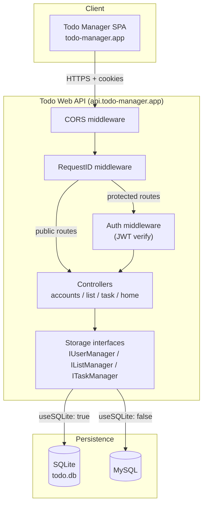
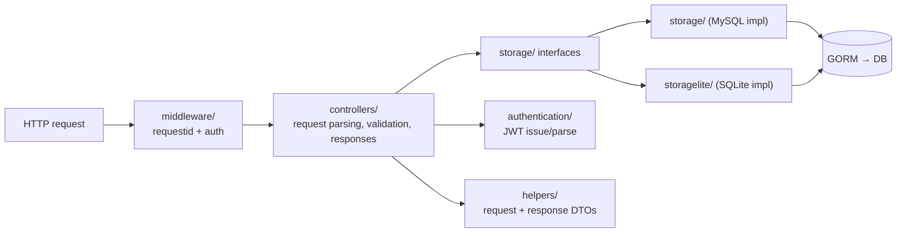
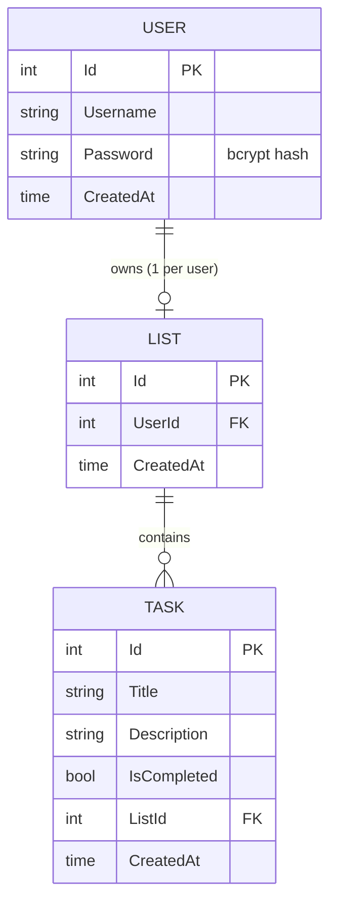

# Todo Web API — Go / Gin Backend

The REST API powering **Todo Manager**. Built with **Go**, the **Gin** web framework, and **GORM**, it handles authentication (JWT in HttpOnly cookies), persistence, and all business logic. The client is a separate **React SPA** ([todo-app-react](https://github.com/YawDev/todo-app-react)).

It ships with a layered architecture (controllers → storage managers → GORM), interface-based storage so the same handlers run against **SQLite** (default, zero-setup) or **MySQL**, structured logging with request-id correlation, and auto-generated **Swagger** docs.

---

## Tech Stack

| Concern | Choice |
| --- | --- |
| Language | Go 1.22 |
| HTTP framework | Gin |
| ORM | GORM |
| Databases | SQLite (default) / MySQL — swappable via config |
| Auth | JWT (HS256), `golang-jwt/jwt/v4` |
| Password hashing | bcrypt (`golang.org/x/crypto`) |
| Logging | logrus, with request-id middleware |
| API docs | Swagger via `swaggo/gin-swagger` |
| Config | YAML (`config.yaml`) |
| Tests | testify + go-sqlmock |

---

## System Architecture

The API sits between the React SPA and the database. Handlers depend on **storage interfaces**, not concrete drivers, so the persistence backend is chosen at startup from config.



### Layered design



---

## Project Structure

```
.
├── main.go                  # Entry: builds config + logger, starts the Service
├── config.yaml              # App, DB, CORS, Swagger settings
├── server/
│   ├── config.go            # Config structs + YAML loader
│   └── service.go           # CORS, Swagger, DB wiring, route registration
├── controllers/             # HTTP handlers
│   ├── accountscontroller.go  # Login, Register, Logout, AuthStatus, RefreshToken, GetUser
│   ├── listcontroller.go      # Create/Delete/Get list
│   ├── taskcontroller.go      # Create/Update/Delete task, ChangeStatus
│   └── homecontroller.go
├── authentication/jwt.go    # Token generation/parsing, in-memory active-token store
├── middleware/
│   ├── authmiddleware.go    # Extracts JWT from header or cookie, verifies
│   └── requestidmiddleware.go
├── models/models.go         # GORM models: User, List, Task
├── helpers/api_helpers.go   # Request/response DTOs (binding + Swagger examples)
├── storage/                 # MySQL implementations + interface definitions
│   ├── database.go          # Interfaces + ConfigureDb() driver selection
│   ├── sql.go, userStore.go, listStore.go, taskStore.go
├── storagelite/             # SQLite implementations
│   ├── sqlite.go            # Connect + AutoMigrate
│   ├── userStoreLite.go, listStoreLite.go, taskStoreLite.go
├── loggerutils/             # logrus setup + context-aware log helpers
├── messages/messages.go     # Centralized message/error strings
├── contextkeys/             # Typed context keys (request id, etc.)
├── docs/                    # Generated Swagger (swagger.json/yaml + docs.go)
└── tests/                   # Controller + storage tests, mock managers
```

---

## Data Model



Models are defined in [models/models.go](models/models.go) and auto-migrated on startup (`AutoMigrate` for SQLite in [storagelite/sqlite.go](storagelite/sqlite.go)).

---

## API Endpoints

Base path: `/api/v1`

### Public

| Method | Path | Description |
| --- | --- | --- |
| GET | `/Home` | Health/home |
| GET | `/AuthStatus` | Returns current session status from cookie |
| POST | `/Login` | Authenticate, issue access + refresh cookies |
| POST | `/Register` | Create account (password bcrypt-hashed) |
| POST | `/RefreshToken` | Issue new access token from refresh cookie |

### Protected (require valid JWT — header `Authorization: Bearer …` **or** `access_token` cookie)

| Method | Path | Description |
| --- | --- | --- |
| GET | `/GetUser/:id` | Fetch user |
| POST | `/CreateList/:id` | Create the user's list (max 1 per user) |
| GET | `/GetList/:userid` | Get a user's list + tasks |
| DELETE | `/DeleteList/:id` | Delete a list |
| POST | `/CreateTask/:listid` | Add a task to a list |
| PUT | `/UpdateTask/:id` | Update task title/description |
| PUT | `/TaskCompleted/:id` | Toggle task completion |
| DELETE | `/DeleteTask/:id` | Delete a task |
| POST | `/Logout` | Invalidate tokens, clear cookies |

Routes are registered in [server/service.go](server/service.go). Full request/response schemas are available via Swagger UI (see below).

---

## Authentication

- On `/Login`, the server verifies the bcrypt password hash, then issues an **access token (30 min)** and **refresh token (1 hr)** as JWTs, set as **HttpOnly, Secure, SameSite=None cookies**.
- Active tokens are tracked in an **in-memory map** (`authentication/jwt.go`), so a token is only accepted while its username has an active server-side entry. Logout removes it.
- `AuthMiddleware` reads the token from the `Authorization: Bearer` header if present, otherwise from the `access_token` cookie, parses/validates it, confirms it's in the active set, and injects `user_id` / `username` into the Gin context.

```mermaid
sequenceDiagram
    participant SPA as Todo Manager SPA
    participant MW as Auth Middleware
    participant Ctrl as Controller
    participant Auth as authentication/jwt
    participant DB as Storage

    SPA->>Ctrl: POST /Login {username, password}
    Ctrl->>DB: FindExistingAccount + bcrypt compare
    Ctrl->>Auth: GenerateAccessToken + GenerateRefreshToken
    Auth-->>Ctrl: JWTs (saved in active-token map)
    Ctrl-->>SPA: Set-Cookie access_token, refresh_token (HttpOnly)

    SPA->>MW: GET /GetList/:userid (cookie attached)
    MW->>Auth: ParseToken + check active map
    Auth-->>MW: claims OK
    MW->>Ctrl: c.Set(user_id, username); Next()
    Ctrl-->>SPA: 200 list + tasks
```

> ⚠️ **Note (in-memory token store):** active/refresh tokens live in process memory, so they reset on restart and won't work across multiple instances. Fine for this single-instance portfolio demo; a production deployment would use Redis or a DB-backed store.

---

## Configuration

All runtime settings come from [config.yaml](config.yaml), loaded in [server/config.go](server/config.go).

```yaml
app:
  port: 8080
  host: "localhost"

database:
  useSQLite: true        # true → SQLite (todo.db); false → MySQL
  driver: "mysql"
  host: "..."            # used only when useSQLite: false
  port: 3306
  username: "..."
  name: "todo_service"

cors:
  allowed_origins: ["https://todo-manager.app"]
  allow_credentials: true

swagger:
  enabled: true
  doc_path: "/swagger/index.html"
```

Switching databases is a one-line change: `useSQLite: true|false`. `ConfigureDb` in [storage/database.go](storage/database.go) selects the matching implementation set at startup.

> ⚠️ **Security:** `config.yaml` currently contains live-looking MySQL credentials and `authentication/jwt.go` uses a hardcoded JWT signing key. For any real/public deployment these must be moved to environment variables/secrets and rotated. See [Hardening notes](#hardening-notes).

---

## Getting Started (local dev)

### Prerequisites

- Go 1.22+
- (Optional) MySQL, only if running with `useSQLite: false`

### Run

```bash
go mod download
go run .          # starts on http://localhost:8080
```

With the default config (`useSQLite: true`) it creates/uses a local `todo.db` SQLite file and auto-migrates the schema — no database setup required. On start it also opens Swagger UI in your browser.

### Swagger / API docs

With `swagger.enabled: true`, browse:

```
http://localhost:8080/swagger/index.html
```

Regenerate docs after changing handler annotations:

```bash
swag init
```

### Tests

```bash
go test ./...
```

Tests under `tests/` cover controllers and storage using mock managers and `go-sqlmock`.

---

## Hardening notes

This is a portfolio project; the following are known shortcuts worth calling out (and good next steps):

- Move DB credentials and the JWT signing key out of source into environment variables/secrets.
- Replace the in-memory token store with Redis or a DB so sessions survive restarts and scale horizontally.
- Add ownership checks so a user can only access their own list/tasks (handlers currently trust the path id).

---

## Related

- **Frontend SPA:** [todo-app-react](https://github.com/YawDev/todo-app-react) — Todo Manager (React 19 + Vite)
